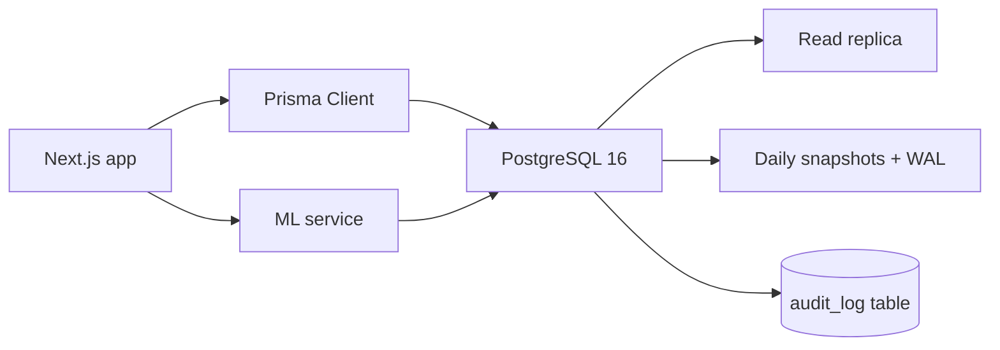

# SmartVyapar V2 — Strong Database Plan

## Current weaknesses (evidence)

- Provider is `sqlite` with `file:./dev.db` in [`prisma/schema.prisma`](prisma/schema.prisma) and [`.env`](.env).
- Multi-tenancy uses raw `companyName` strings (e.g. `Customer.companyName`, `Product.companyName`, `Order.companyName`) instead of an FK to `Company`.
- Money is stored as `Float` (e.g. `Invoice.totalAmount`, `Payment.amount`, `Asset.purchaseValue`) — lossy for currency math.
- JSON encoded as strings: `Invoice.customerDetails`, `Visit.photoIds`, `Scheme.applicableProducts`, `VanLoad.actualRoute`, `Photo.stockSnapshot`.
- Soft references with no FK constraints: `Order.invoiceId`, `Visit.orderId`, `SalesReturn.creditNoteId`, `CreditNote.usedInInvoiceId`, `User.employeeId`.
- Few indexes on heavy query columns (`Invoice.companyName+date`, `Payment.customerId`, `Customer.phone`, etc.).
- No soft-delete, no row-level audit log table, no migration discipline beyond 4 historical SQLite migrations in [`prisma/migrations`](prisma/migrations).
- App opens raw SQL in 8+ files (e.g. [`src/actions/customer-prediction.ts`](src/actions/customer-prediction.ts), [`src/actions/credit.ts`](src/actions/credit.ts)) which will need Postgres-compatible review.

## Target architecture (V2)

## Phase 1 - Foundation (Postgres + integrity)

- Switch provider to `postgresql` in [`prisma/schema.prisma`](prisma/schema.prisma); set `DATABASE_URL` to a managed Postgres (e.g. Neon/Supabase/RDS) in [`.env`](.env) plus a separate `DIRECT_URL` for migrations.
- Re-baseline migrations: archive existing SQLite migrations to `prisma/migrations.legacy/`, then `prisma migrate dev --name v2_baseline_postgres`.
- Replace tenant string with FK:
  - Add `companyId String` + `company Company @relation(...)` on every tenant-scoped model.
  - Backfill via a one-shot migration script that maps existing `companyName` -> `Company.id`.
  - Keep `companyName` temporarily as denormalized cache for snapshots only.
- Convert money fields from `Float` to `Decimal @db.Decimal(14,2)` across `Invoice`, `InvoiceItem`, `Payment`, `Order`, `OrderItem`, `Asset`, `CustomerCredit`, `Scheme`, `VanLoad`, `VanSale`, `Payroll`.
- Replace JSON-as-string columns with `Json @db.JsonB` (e.g. `Invoice.customerDetails`, `Photo.stockSnapshot`, `VanLoad.plannedRoute`).
- Add missing FKs (with `onDelete` rules) for `Order.invoiceId`, `Visit.orderId`, `User.employeeId`, `SalesReturn.creditNoteId`, `CreditNote.usedInInvoiceId`.

## Phase 2 - Performance (indexes + constraints)

- Composite indexes on hot read paths:
  - `Invoice(companyId, date)`, `Invoice(companyId, status, dueDate)`
  - `Payment(companyId, customerId, collectedAt)`
  - `Order(companyId, status, createdAt)`
  - `Visit(companyId, employeeId, checkInTime)`
  - `CreditNote(companyId, status)`, `SalesReturn(companyId, status)`
  - `Customer(companyId, phone)`, `Customer(companyId, gstin)`
- Uniques scoped per tenant where appropriate (`Customer.gstin` should be `@@unique([companyId, gstin])` instead of global).
- Add CHECK-style invariants via Postgres (`@db.Decimal` + `>= 0` checks via raw migration) for stock, balances, and amounts.

## Phase 3 - Reliability (audit, soft delete, backups)

- Add a single `AuditLog` model: `id`, `companyId`, `actor`, `entity`, `entityId`, `action`, `before Json?`, `after Json?`, `createdAt` and write to it from a Prisma middleware in [`src/lib/db.ts`](src/lib/db.ts).
- Add `deletedAt DateTime?` + `@@index([companyId, deletedAt])` for soft-deletable models (`Customer`, `Product`, `Invoice`, `Order`, `Employee`).
- Wire a default `where: { deletedAt: null }` extension on Prisma client in [`src/lib/db.ts`](src/lib/db.ts).
- Backups: enable managed Postgres PITR + add `npm run backup:pg` that runs `pg_dump` on a schedule; replace [`scripts/backup-local.js`](scripts/backup-local.js) for SQLite-only path.

## Phase 4 - Data quality + tooling

- Add a Prisma `seed.ts` that produces a deterministic demo dataset replacing ad-hoc scripts.
- Add `npm run db:check` running `prisma validate`, `prisma migrate status`, and a SQL drift check.
- Document conventions in `prisma/README.md`: tenancy FK rule, Decimal money, JSON usage, index naming, soft-delete contract.

## Cutover (one-time)

1. Stand up Postgres instance and copy `.env` to `.env.production`/`.env.local`.
2. Run V2 baseline migration on empty DB.
3. Export current SQLite data via `sqlite3 dev.db .dump` and run a transformation script that:
   - Creates `Company` rows from distinct `companyName` strings.
   - Rewrites tenant FKs and money fields to Decimal.
   - Re-keys JSON-string fields into `JsonB`.
4. Run integrity checks: row counts per table match source, sum of `Invoice.totalAmount` equals source within Decimal precision.
5. Switch app `DATABASE_URL` to Postgres; redeploy.

## Touch list (high level)

- [`prisma/schema.prisma`](prisma/schema.prisma) - schema rewrite (provider, types, FKs, indexes, soft delete, audit).
- [`prisma/migrations`](prisma/migrations) - new baseline + transformation migrations.
- [`src/lib/db.ts`](src/lib/db.ts) - Prisma extensions for audit + soft delete.
- [`.env`](.env) - `DATABASE_URL`/`DIRECT_URL` for Postgres.
- [`scripts/backup-local.js`](scripts/backup-local.js) - replace with `pg_dump`-based backup.
- All `src/actions/*.ts` files using `prisma.$executeRaw` (e.g. [`src/actions/credit.ts`](src/actions/credit.ts), [`src/actions/customer-prediction.ts`](src/actions/customer-prediction.ts)) - port any SQLite-specific SQL to Postgres-compatible syntax.
